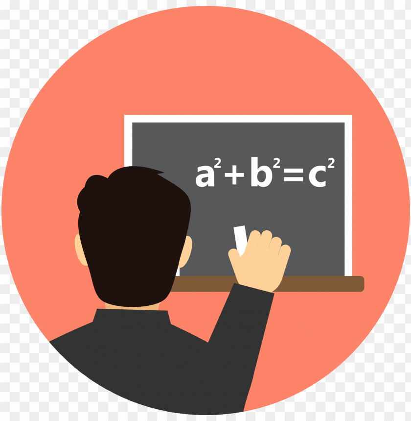
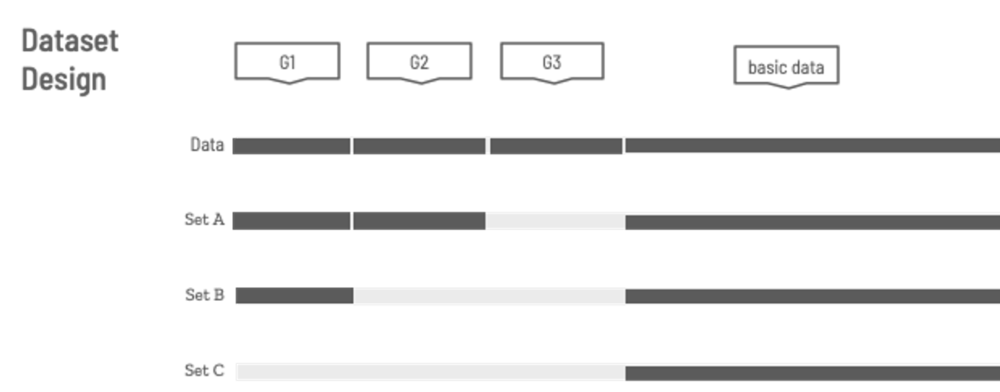
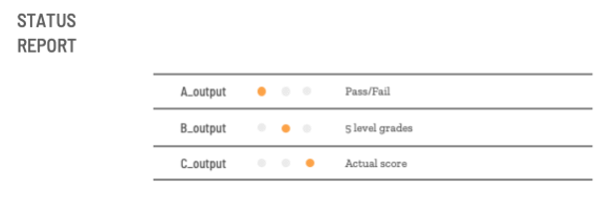
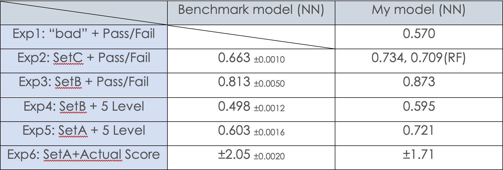

# Student_Performance_Analysis

Udacity Machine Learning Nanodegree, Final Project, August 2020

Author: JasonM

## Abount this project
In this project, I dive into a student grades dataset from a Portuguese high school. I tried to figure out what behaviors or features impact students’ grades most. Would it be the same with many parents’ opinions that exists some “bad” activities cause a decrease in grades. In the beginning, I pick a little data and assume a null-hypothesis and alternative-hypothesis set. By modeling the data and using a single-tailed Binomial Distribution examination, I get the conclusion with data. Then, I replace the dataset with all background information to find out the top 10 important behaviors or features in the dataset. Inspiring by the result of permutation feature importance, I decided to add past grades into the dataset and try to increase the difficulty. From Pass/ Fail binary classification, to 5 levels multi-label classification, actual score prediction in the end.

## Background
This is my capstone project in Udacity Machine Learning Engineer Nanodegree. The reason why I am so interested in this topic is that I heared a lot of strange questions and requests. My mom always tells me that puppy love (crush, 早恋), internet, and games would put down my grade. But, could that happen? My aunt said a good relationship of the parents and even the career of the parents could affect children’s grades. But, is that true? My teacher said she know how would I perform in the final exam by reading my previous tests. But, is that possible? 
  

    

  
There are so many rumors and myths in the field of education... 
I want to find out which are trues or not ლ(•̀ _ •́ ლ)

## Dataset
  

    

  

http://archive.ics.uci.edu/ml/datasets/Student+Performance#

  

### A dataset contains math grades from a high school in Portugal 
**`More detail for this dataset, check 'student.txt stored in '/data'`** 
<table border="0" bgcolor="#000000">
    <tr>
        <td>
            
        </td>
        <td>
            
        </td>
    </tr>
</table>

## Apply Portuguese Trimester to American Semester
     G1 -> the final exam of the first semester
     G2 -> the midterm of the second semester
     G3 -> the final exam of the second semester (the Goal!)

## X dataset design

    

  * **`Set A -> basic data + G1 + G2 (Contains the most of the original dataset)`**
  * **`Set B -> basic data + G1 (Contains less information than Set A)`**
  * **`Set C -> basic data ONLY (Contains the least information)`**

## y dataset desgin

    

  * **`A_output -> Pass/ Fail (The easiest one)`**
  * **`B_output -> 5 levels grade (Increasing the difficulty)`**
  * **`C_output -> Actual score (The most difficult one. Predicting the score in the final exam 'G3')`**

## Performance Compared to benchmark models
  

    

  

## Reference
P. Cortez and A. Silva. Using Data Mining to Predict Secondary School Student Performance. In A. Brito and J. Teixeira Eds., Proceedings of 5th FUture BUsiness TEChnology Conference (FUBUTEC 2008) pp. 5-12, Porto, Portugal, April, 2008, EUROSIS, ISBN 978-9077381-39-7.

`This is a demo project for me. Practicing Pytorch, scikit-learn, and AWS sagemaker. Thanks to the original authors! Hope you like this project :)`

